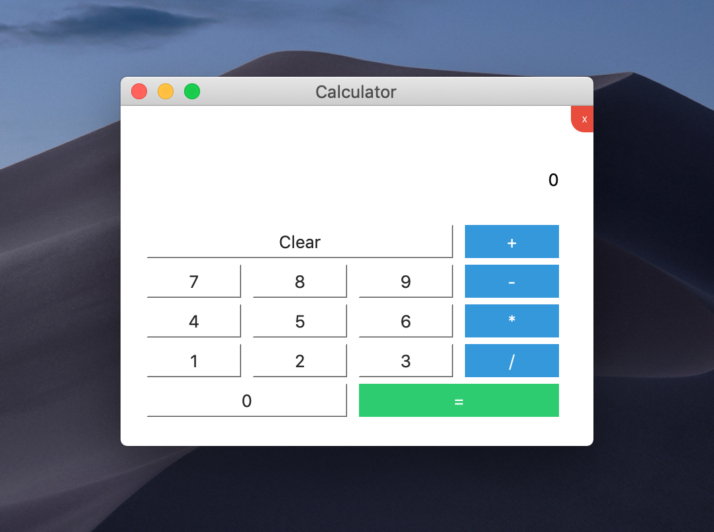

# QCalculator
A Quick & simple Desktop based Calculator using [Qt](https://www.qt.io/) & [C++](https://en.wikipedia.org/wiki/C%2B%2B).

## Built With
*[Xcode](*[Xcode-beta](https://developer.apple.com/documentation/xcode_release_notes/xcode_10_2_release_notes))
*[Qt Creator](https://www.qt.io/download-qt-installer?hsCtaTracking=9f6a2170-a938-42df-a8e2-a9f0b1d6cdce%7C6cb0de4f-9bb5-4778-ab02-bfb62735f3e5).
